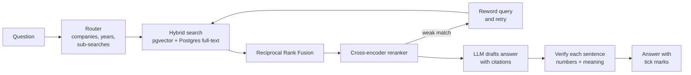

# FilingLens

**Ask questions about public companies' annual reports and get answers you can check.**

FilingLens answers questions about SEC 10-K filings from 12 large US companies. Every
sentence in an answer cites the passage it came from, and a verification step checks each
sentence against that passage before you see it. If the filings don't contain the answer,
it says so instead of guessing.

> Live demo: _add your Render link here_

<!-- Add a screenshot after your first run: save it as docs/screenshot.png and uncomment:
 -->

## How it works



1. **Router.** Finds the companies and fiscal years in the question ("Google" → GOOGL,
   "FY23" → 2023) and splits comparisons into one search per company and year. This part
   is plain Python, so it never invents a ticker.
2. **Hybrid search.** Runs a vector search (pgvector, `bge-small-en-v1.5`) and a keyword
   search (Postgres full-text) and merges them with Reciprocal Rank Fusion.
3. **Reranker.** A cross-encoder (`ms-marco-MiniLM-L-6-v2`) re-reads the top 30 passages
   and orders them by relevance.
4. **Retry.** If the best passage is weak, the LLM rewrites the search using other 10-K
   terms and the better result is kept.
5. **Answer.** The LLM writes 1 to 5 sentences, each ending with a source number, or
   replies that there isn't enough evidence.
6. **Verification.** Each sentence is checked two ways:
   - **Numbers:** every figure must appear in the cited source. It handles 10-K tables
     reported "in millions", so "$8.7 billion" matches `8,675`, and allows for rounding.
   - **Meaning:** the sentence must be close in meaning to a sentence or table row in the
     cited source.

## Results

Run on a hand-labeled benchmark (`eval/questions.json`). Each row turns on one more part
of the pipeline.

| Setup | Recall@5 | Numbers correct | Correct refusals | Faithfulness | Median latency (s) |
|---|---|---|---|---|---|
| Vector only | _fill in_ | | | | |
| + Keyword (hybrid) | | | | | |
| + Reranker | | | | | |
| + Router and retry (full) | | | | | |

_Generate this table with `python -m eval.run_eval` (see below)._

## Tech stack

Python, FastAPI, PostgreSQL + pgvector, fastembed (ONNX embeddings and cross-encoder,
no PyTorch), Ollama / Claude API, Docker, GitHub Actions, Render. The frontend is plain
HTML, CSS and JavaScript with no build step.

## Project structure

```
src/
  ingest/      download.py, parse.py, index.py, companies.py
  retrieval/   search.py        hybrid search, RRF, reranking
  agent/       router.py, pipeline.py, verify.py, prompts.py
  api/         main.py          FastAPI app + streaming endpoint
  config.py, db.py, embeddings.py, llm.py, numbers.py
frontend/      index.html, styles.css, app.js
eval/          questions.json, run_eval.py
tests/         unit tests + an end-to-end test
```

---

## Run it locally

### 1. Install

You need Python 3.11+, Git, Docker Desktop and Ollama.

```bash
git clone https://github.com/KirtanPatel30/filinglens.git
cd filinglens

python -m venv venv
# Windows:
venv\Scripts\activate
# Mac/Linux:
source venv/bin/activate

pip install -r requirements-ingest.txt
```

Copy the settings file and add your name and email for the SEC:

```bash
# Windows
copy .env.example .env
# Mac/Linux
cp .env.example .env
```

Then open `.env` and set `SEC_IDENTITY="Your Name your.email@example.com"`.

### 2. Start the database and the model

```bash
docker compose up -d
ollama pull qwen2.5:7b
```

If your laptop has less than 16 GB of RAM, use a smaller model:
`ollama pull llama3.2:3b` and set `OLLAMA_MODEL=llama3.2:3b` in `.env`.

### 3. Build the dataset (run once)

```bash
python -m src.ingest.download   # ~36 filings from SEC EDGAR, a few minutes
python -m src.ingest.parse      # splits them into sections, tables and chunks
python -m src.ingest.index      # embeds and loads into Postgres, 10-20 minutes on CPU
```

To try the whole flow quickly first, run `python -m src.ingest.index --limit 500`.
After changing the parser, re-run `parse` and then `index --reset`.

### 4. Start the app

```bash
uvicorn src.api.main:app --reload
```

Open http://localhost:8000. The first start downloads the search models (about 150 MB).

### 5. Test and evaluate

```bash
pip install pytest
pytest -q                 # unit tests; no database or model needed
python -m eval.run_eval   # ablation table -> eval/results/ablation.md
```

To grow the benchmark, open a filing, find the passage that answers a question, and add
it to `eval/questions.json` with its `gold` location and `expected_numbers`.

---

## Deploy

The hosted version uses a cloud database and a hosted LLM. Ollama runs on your laptop,
and Render can't reach it, so the demo uses the Claude API (a few cents per day of use)
or Groq's free tier instead.

### 1. Push to GitHub

```bash
git init
git add .
git commit -m "FilingLens: verified RAG over SEC 10-K filings"
git branch -M main
git remote add origin https://github.com/KirtanPatel30/filinglens.git
git push -u origin main
```

Create the empty `filinglens` repo on GitHub first. `.env` and `data/` are ignored, so
your keys and the downloaded filings are never uploaded.

### 2. Create a free database on Neon

1. Sign up at [neon.tech](https://neon.tech) and create a project.
2. Copy the connection string (it ends in `?sslmode=require`).
3. Load your data into it from your laptop by pointing `DATABASE_URL` in `.env` at Neon
   and running:

   ```bash
   python -m src.ingest.index --reset
   ```

   Neon's free tier (0.5 GB) holds this dataset comfortably.

### 3. Deploy on Render

1. On [render.com](https://render.com), choose **New → Blueprint** and pick your repo.
   Render reads `render.yaml`.
2. Fill in the secret values when asked:
   - `DATABASE_URL`: your Neon connection string
   - `ANTHROPIC_API_KEY`: from console.anthropic.com
3. Deploy. Health check: `https://your-app.onrender.com/api/health`.

To use Groq instead, set `LLM_PROVIDER=openai`, `OPENAI_BASE_URL=https://api.groq.com/openai/v1`,
`OPENAI_API_KEY` and `OPENAI_MODEL=llama-3.1-8b-instant` in the Render dashboard.

**Free-tier notes.** Free Render services sleep after 15 minutes idle and take about a
minute to wake up. The free plan has 512 MB of memory; if the service restarts with an
out-of-memory error, set `USE_RERANK=false` (answers get slightly less precise) or move
to the Starter plan.

---

## Configuration

All settings are environment variables; see `.env.example`. The useful ones:

| Variable | Default | What it does |
|---|---|---|
| `LLM_PROVIDER` | `ollama` | `ollama`, `anthropic`, `openai` (also Groq/OpenRouter), `mock` |
| `OLLAMA_MODEL` | `qwen2.5:7b` | Local model name |
| `USE_BM25` / `USE_RERANK` / `USE_AGENT` / `USE_VERIFY` | `true` | Turn pipeline stages on or off |
| `TOP_K` | `6` | Passages kept per search |
| `SUPPORT_THRESHOLD` | `0.72` | How close a sentence must be to its source to count as verified |
| `RETRY_MIN_RERANK` | `0.25` | Retry the search when the best match scores below this |

The **Pipeline settings** panel in the app changes the same switches per question.

## Limitations

- Covers 12 companies and their three most recent 10-Ks; add more in
  `src/ingest/companies.py`.
- Section splitting relies on "Item 1A"-style headings. Filings with unusual layouts can
  lose a section; the parse step prints a warning when it finds fewer than four.
- Meaning checks use embedding similarity, which can miss subtle contradictions. Numbers
  are checked strictly.
- Not investment advice.


